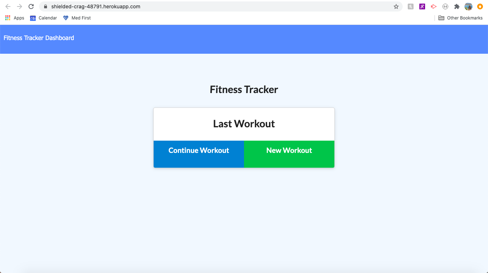

# workout-tracker


## Table of Contents
* [Description](#description)
* [Installation](#installation)
* [Technologies Used](#technologies-used)
* [Application Demo](#application-demo)
* [Contact Information](#contact-information)

## Description
This application is designed to allow you, as a user, to be able to view, create, and track daily workouts. It allows you to be able to log multiple exercises in a workout on any given day. It also allows you to track the name, type, weight, sets, reps, distance, or duration of an exercise. 

## Installation
This application is deployed on Heroku. To use this application, you must install the following:
* Express npm package: ```npm install express```
* Mongoose npm package: ```npm install mongoose```
* Morgan npm package: ```npm install morgan```

And run: ```node server.js```

## Technologies Used
HTML, CSS, JavaScript, Node JS, MongoDB, Express, Mongoose, Morgan

## Application Demo


## Contact Information
* Masiel Bautista
  * GitHub Profile: https://github.com/masielb